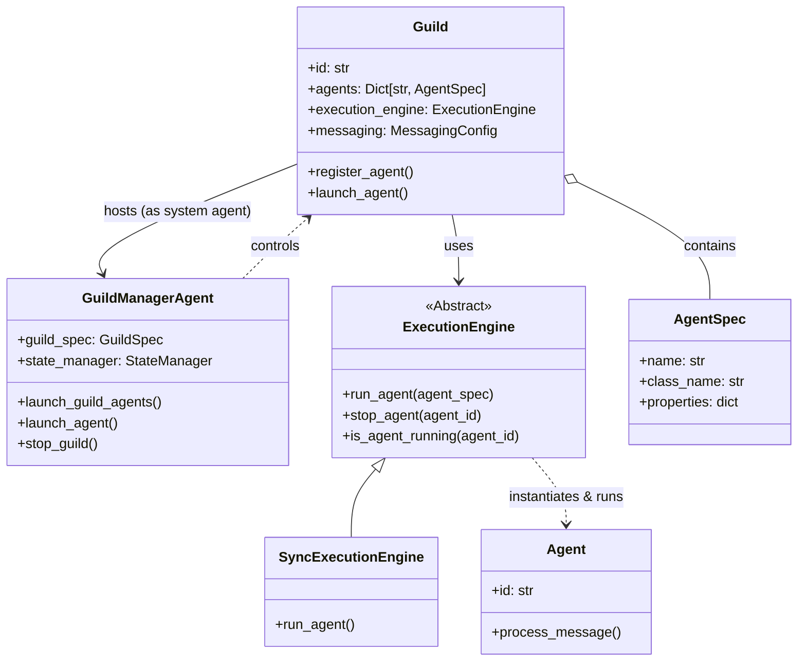
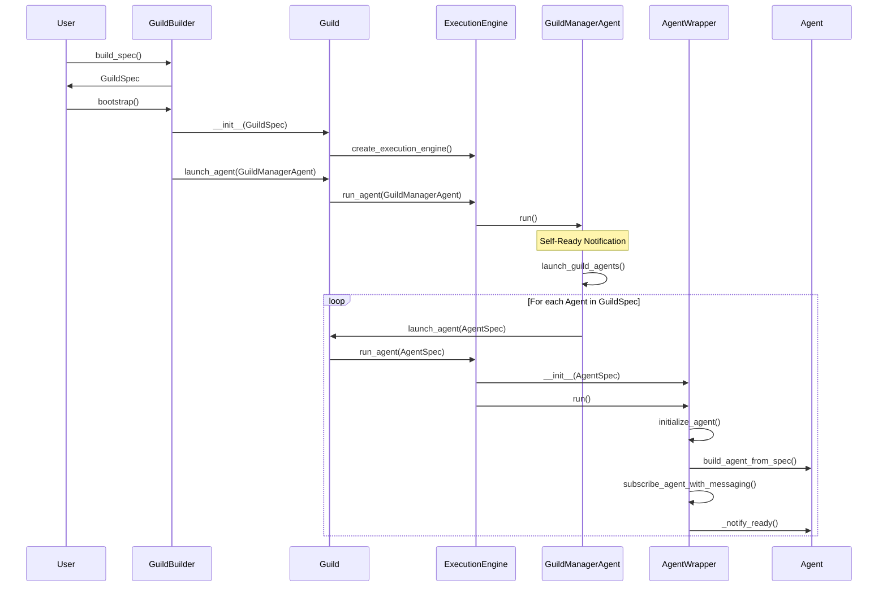

# Rustic AI: Agent Orchestration Mechanism

This document provides a developer-level deep dive into the orchestration mechanism of Rustic AI. It explains how Guilds and Agents are defined, instantiated, and executed, covering the flow from high-level DSL definitions to low-level runtime execution.

## 1. High-Level Architecture

Rustic AI's orchestration revolves around a few key concepts:

*   **Guild**: The primary container and orchestration unit. It manages a collection of Agents, their lifecycle, and the resources they share (like messaging and state).
*   **Guild Manager Agent**: A special system agent that acts as the supervisor for the Guild. It handles bootstrapping, dynamic agent launching, and state monitoring.
*   **Agent**: The fundamental unit of work. Agents are reactive components that process messages. They are defined by an `AgentSpec`.
*   **Execution Engine**: The runtime environment that actually "runs" the agents. It abstracts away the concurrency model (e.g., synchronous, threaded, multi-process).
*   **Messaging**: The communication backbone. Agents communicate exclusively via messages.
*   **Routing Slip**: A mechanism attached to messages that defines a dynamic workflow or "itinerary" for the message, directing it through a sequence of agents.

### Architecture Diagram



## 2. The Flow: From Definition to Runtime

The orchestration process follows a clear pipeline:
1.  **Definition**: You define your Guild and Agents using the Domain Specific Language (DSL) objects (`GuildSpec`, `AgentSpec`) or Builders (`GuildBuilder`, `AgentBuilder`).
2.  **Construction**: A `Guild` instance is created from the `GuildSpec`.
3.  **Bootstrapping**: The `Guild` initializes its `ExecutionEngine` and `Messaging` system. Crucially, it launches the `GuildManagerAgent`.
4.  **Orchestration**: The `GuildManagerAgent` takes over, reading the guild configuration and instructing the `Guild` to launch the remaining application agents.
5.  **Execution**: Agents are "launched" into the `ExecutionEngine`, which wraps them in an `AgentWrapper` and starts their processing loop.

### Sequence Diagram: Instantiation



## 3. Detailed Mechanism

### 3.1 Definition (DSL)

Everything starts with `AgentSpec` and `GuildSpec` in `rustic_ai.core.guild.dsl`.

*   **AgentSpec**: Defines *what* an agent is (class name, configuration properties, subscribed topics).
*   **GuildSpec**: Defines the guild's configuration (messaging backend, execution engine type) and the list of `AgentSpec`s it contains.

**Code Snippet (Agent Definition via Builder):**
```python
from rustic_ai.core.guild.builders import AgentBuilder
from my_agents import MyCustomAgent

agent_spec = (
    AgentBuilder(MyCustomAgent)
    .set_name("MyAgent")
    .set_description("A custom agent")
    .build_spec()
)
```

### 3.2 Guild Bootstrapping & The Guild Manager

When a `Guild` is bootstrapped (via `GuildBuilder.bootstrap`), it doesn't immediately launch all user agents. Instead, it launches a **GuildManagerAgent**.

*   **Role**: The `GuildManagerAgent` is the "supervisor" of the guild.
*   **Responsibilities**:
    *   **Metastore Sync**: It syncs the `GuildSpec` and `AgentSpec`s to the persistent metastore (database).
    *   **State Management**: It initializes the `StateManager` to track agent health and status.
    *   **Agent Launching**: It iterates through the `GuildSpec.agents` and calls `self.guild.launch_agent()` for each one.
    *   **Monitoring**: It processes `Heartbeat` messages from agents to maintain the guild's health status.

**Key File**: `core/src/rustic_ai/core/agents/system/guild_manager_agent.py`

### 3.3 Agent Execution

The `Guild.launch_agent(agent_spec)` method delegates to `ExecutionEngine.run_agent`.

#### The Execution Engine
The `ExecutionEngine` is responsible for the *how* of running an agent.
*   **SyncExecutionEngine**: Runs agents synchronously in the current process (mostly for testing/debugging).
*   **Multiprocess/Threaded Engines**: (Conceptually) run agents in separate processes or threads.

#### The Agent Wrapper
The engine wraps the `AgentSpec` in an `AgentWrapper`. This wrapper handles the "plumbing":
1.  **Dependency Injection**: Resolves dependencies defined in the spec.
2.  **Instantiation**: Dynamically loads the python class defined in `class_name` and instantiates the `Agent` object.
3.  **Subscription**: Connects the agent's client to the messaging system, subscribing to its inbox and other relevant topics.

**Key File**: `core/src/rustic_ai/core/guild/execution/agent_wrapper.py`

```python
# Simplified flow from AgentWrapper.initialize_agent
def initialize_agent(self) -> Agent:
    # ... load dependencies ...
    self.messaging = MessagingInterface(self.guild_spec.id, self.messaging_config)

    # Instantiate the actual Agent class
    self.agent = build_agent_from_spec(...)

    # Subscribe to topics
    subscribe_agent_with_messaging(self.agent, self.messaging, ...)

    return self.agent
```

### 3.4 Orchestration & Routing

Once agents are running, orchestration happens via **Messages**. Rustic AI uses a decentralized orchestration model powered by **Routing Slips**.

*   **Routing Slip**: A list of `RoutingRule`s attached to a message. It tells the system "After Agent A processes this, send it to Agent B, then Agent C".
*   **Message**: Contains the payload, metadata, and the `RoutingSlip`.

#### Message Flow
1.  **Ingest**: A message enters the system (e.g., via a Gateway or manual injection).
2.  **Processing**: An agent receives the message.
3.  **Routing Evaluation**: The agent (or the messaging infrastructure) looks at the `RoutingSlip`.
    *   If there are more steps, it determines the next destination (Agent/Topic) based on the current rules.
    *   It decrements the step counter or marks the step as complete.
4.  **Forwarding**: The message is published to the next topic defined in the Routing Slip.

**Code Snippet (Routing Logic in `core/src/rustic_ai/core/messaging/core/message.py`):**
```python
# Simplified logic from RoutingSlip.get_next_steps
def get_next_steps(self, agent, ...):
    # Find rules applicable to the current agent/context
    next_steps = [step for step in self.steps if step.is_applicable(...)]

    # Update state for next hop
    for next_step in next_steps:
        next_step.decrement_route_times()

    return next_steps
```

### 3.5 Cross-Guild Orchestration

For complex systems involving multiple Guilds, Rustic AI supports **Gateway Agents** and **Boundary Agents**.
*   **Gateway**: Acts as an entry/exit point for the Guild.
*   **GuildStack**: Messages track the stack of guilds they have traversed (`origin_guild_stack`), allowing responses to route back through the chain of guilds.

## Summary

To contribute to Rustic AI's orchestration:
1.  **Modify `Guild`** in `core/src/rustic_ai/core/guild/guild.py` if you need to change how resources are managed.
2.  **Implement a new `ExecutionEngine`** (inherit from `ExecutionEngine` in `core/src/rustic_ai/core/guild/execution/execution_engine.py`) if you want to support a new runtime (e.g., Kubernetes, Ray).
3.  **Update `AgentWrapper`** if you need to change how agents are initialized or wired up to the infrastructure.
4.  **Extend `RoutingSlip`** in `core/src/rustic_ai/core/messaging/core/message.py` if you need more complex flow control patterns.
